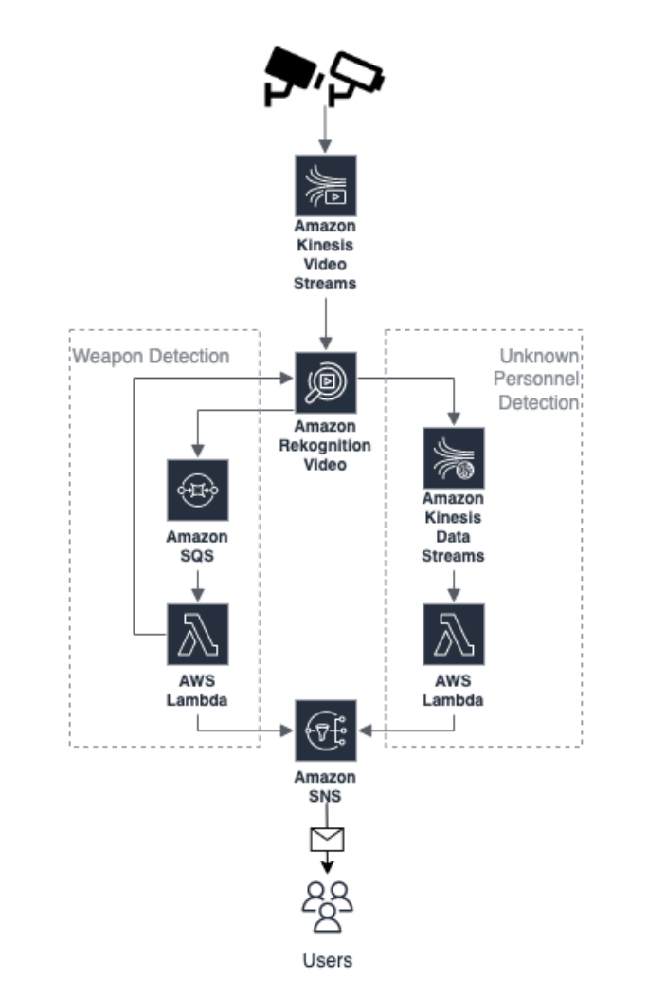
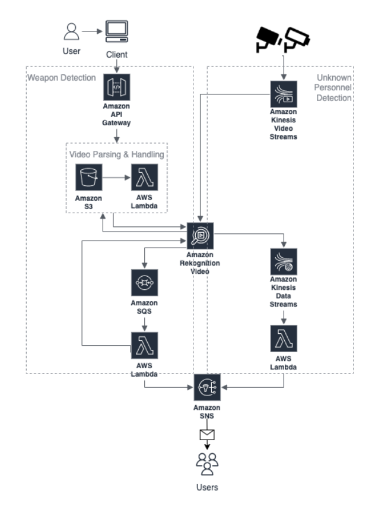
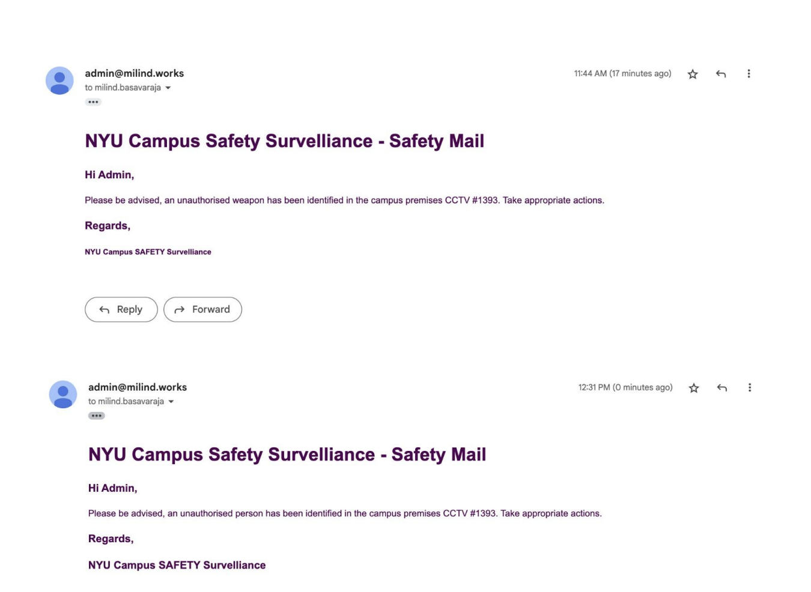

# NYU Campus Safety Surveillance
 
**NYU Campus Safety Surveillance**, a system that will ideally have access to video feeds of all CCTV cameras in and around the
campus. Whenever a weapon or unauthorized personnel is found inside the campus premises, the system will send out appropriate 
action emails to concerned campus security personnel.

### Proposed Architecture
This architecture relies heavily on **AWS Kinesis Video and Data streams**. As of November 2021, this product has an on-demand 
auto-scaling feature as well which can take any amount of data, from any number of sources, and scale up and down as needed.

### Drawbacks & Pain Points
We were not able to store video stream objects in S3 or any storage component which could have been linked to a Lambda
function and then used for further processing using SageMaker or Rekognition. In the proposed architecture we had to detect 
custom objects (guns, knives, etc) in the live-stream video feed and AWS Rekognition only supports standard objects like person, 
pet, and Amazon package. Because of these limitations, we could not implement it according to the exact architecture and
modified the system. We have exposed API and an option to upload a video (which can be streamed from a CCTV/Webcam) as well.

### Current Architecture
In this architecture, we handle weapon detection and unauthorized personnel detection differently. For weapon detection,
we have exposed an endpoint via API Gateway to upload video objects. That video object is stored in S3 which triggers a
Lambda to process it. Lambda interacts with AWS Rekognition to fetch the labels of objects in the video and decides if it 
contains any weapons.

### Sample Outputs
Whenever a suspicious weapon is identified or an unauthorized person is identified on the campus premises, the system sends out
appropriate notifications to concerned security personnel to take further action.

